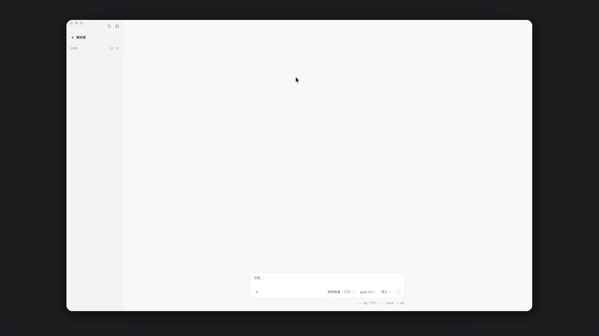
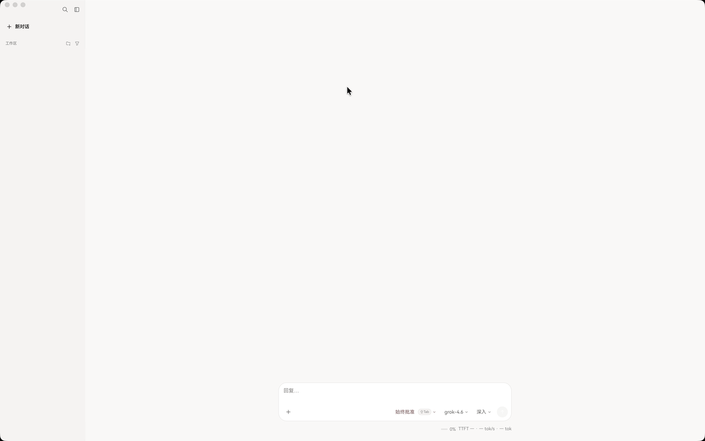
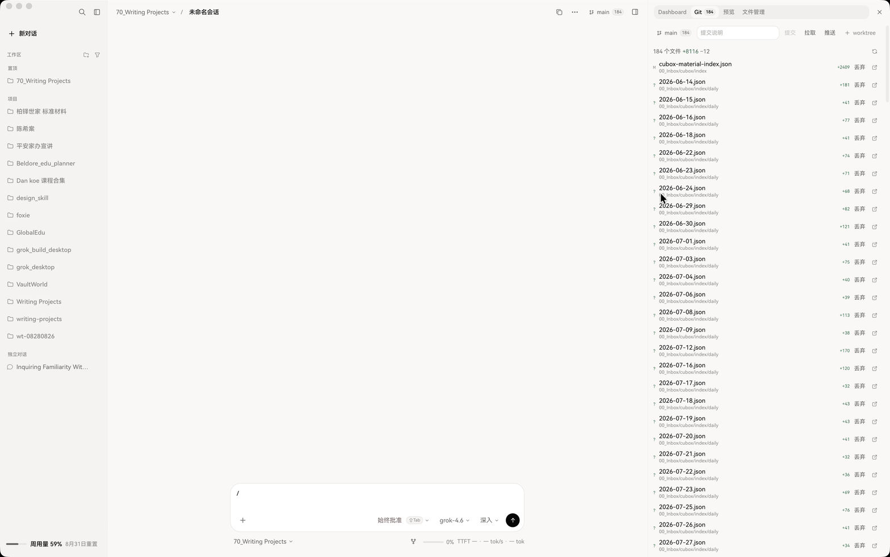
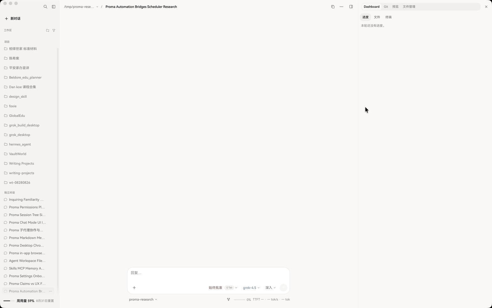

<h1 align="center">
  
  <br>
  Grok Build Desktop
</h1>

<p align="center">
  <strong>Native ACP workbench for coding agents.</strong>
</p>

<p align="center">
  Chat, sessions, permissions, Git, and file review live on the desktop.<br>
  The model loop stays in the CLI you already run.
</p>

<p align="center">
  <a href="https://github.com/Stauch99/grok-build-desktop/stargazers"></a>
  <a href="https://github.com/Stauch99/grok-build-desktop/releases/latest"></a>
  <a href="https://github.com/Stauch99/grok-build-desktop/actions/workflows/ci.yml"></a>
  <a href="LICENSE"></a>
  <a href="https://tauri.app/"></a>
  <a href="https://agentclientprotocol.com/"></a>
</p>

<p align="center">
  <a href="#中文">中文</a>
  ·
  <a href="docs/HANDOFF.md">Handoff</a>
  ·
  <a href="CONTRIBUTING.md">Contributing</a>
</p>

<p align="center">
  
</p>

This is a **community** desktop client. It is not an official xAI, Anthropic, OpenAI, or Moonshot product.

## Preview

Empty-state captures. No real projects, sessions, or file names.

| Chat | Git | Dashboard |
| :---: | :---: | :---: |
|  |  |  |

## Why this exists

Coding CLIs already know how to plan, edit, and run tools. What they lack is a calm place to *watch* that work: sessions beside projects, a permission card when the agent wants the network, a diff you can rewind, a Git pane that does not steal the chat.

Grok Build Desktop is that place. It speaks [Agent Client Protocol](https://agentclientprotocol.com/) over stdio. It does not reimplement the model loop.

## Agents

| Agent | How it starts |
| --- | --- |
| **Grok** | `grok agent stdio` |
| **Kimi** | `kimi acp` |
| **Claude** | `npx -y @agentclientprotocol/claude-agent-acp@0.70.0` |
| **Codex** | `npx -y @agentclientprotocol/codex-acp@1.7.0` |

## What you get

- **Projects and sessions** — pin, archive, split panes, resume from each CLI’s own history
- **Live turn** — streaming text, thoughts, plans, classified tool calls, permission cards
- **Workbench chrome** — explorer, preview (Markdown + Mermaid), Git status / history / commit, review rail
- **One Skills / MCP plane** — canonical store is `~/.agents`, then synced into each enabled CLI
- **Growth memory** — a workbench journal, heatmap, and a stdio MCP server (`grok-build-memory`) so any CLI can read USER.md and append daily notes

What it is **not**: a full IDE, a browser web UI, or a replacement for `git`, `lldb`, or your `$EDITOR`.

## Requirements

- macOS 13+ is the development and verification environment. Tauri also bundles Windows (NSIS/MSI) and Linux (deb/AppImage).
- Node 22+ and a current Rust toolchain (for `tauri dev` / `tauri build`)
- At least one ACP CLI installed and logged in (Grok, Kimi, Claude Code, or Codex)

## Download

Prebuilt installers are published on [GitHub Releases](https://github.com/Stauch99/grok-build-desktop/releases) (macOS `.dmg`, Windows NSIS/MSI, Linux `.deb` / AppImage). The app has no in-app auto-update — install a new build when you want one. Each tagged release includes `SHA256SUMS`:

```bash
shasum -a 256 -c SHA256SUMS --ignore-missing
```

You still need at least one ACP CLI installed and logged in. For UI work without a CLI:

```bash
GROK_BUILD_ACP=mock npm run tauri dev
```

## Quick start

```bash
git clone https://github.com/Stauch99/grok-build-desktop.git
cd grok-build-desktop
npm install
npm test
npm run tauri dev
```

Frontend-only typecheck and tests (no Rust):

```bash
npm run typecheck
npm test
```

Production bundle:

```bash
npm run tauri build
```

macOS artifacts land in `src-tauri/target/release/bundle/macos/` and `dmg/`.

## Memory MCP (any CLI)

The workbench copies a `memory-mcp` sidecar to `~/.acp-workbench/bin/` and registers `grok-build-memory` into Grok / Kimi / Claude / Codex when **Settings → Allow CLIs to read and write memory** is on. Other MCP clients can attach the same stdio server:

```json
{
  "mcpServers": {
    "grok-build-memory": {
      "command": "/Users/YOU/.acp-workbench/bin/memory-mcp"
    }
  }
}
```

Tools: `memory_get`, `memory_recall`, `memory_append`, `memory_timeline`, `memory_forget`. Appends go to `daily/`; only the desktop dream sweep writes `USER.md`.

Memory files (`USER.md`, `daily/*.md`) are **plaintext on disk**. The MCP server drops Slack/GitLab/PEM/Bearer-shaped strings and other key-like tokens, but that is a heuristic — do not treat memory as a secret store.

## Architecture in one picture

```
React chrome  ──AgentPort──►  Tauri AgentHost (one ACP child per agentId)
                                   │
                    GrokAdapter / KimiAdapter / ClaudeAdapter / CodexAdapter
                                   │
                              CLI stdio (ACP)
```

UI talks to sessions only through `AgentPort`. Skills and MCP go through `AgentsStore` (`~/.agents`), not per-CLI copies of the hub. See [docs/HANDOFF.md](docs/HANDOFF.md) if you are forking or adding a fifth agent.

## Status and boundaries

- Desktop-only. No browser mode, no remote control plane.
- “Rewind to here” restores files that have a **known session diff**. It is not a full workspace rollback.
- “Open in terminal” launches Terminal.app on macOS, `x-terminal-emulator` / `xdg-terminal-exec` on Linux, and Windows Terminal / `cmd`. If none start, the `cd` command is copied so you can paste it.
- Imagine / video stays on the existing Grok path. Other providers are out of scope for this wave.
- No in-app auto-update. Install new builds yourself.

## Docs

| Doc | For |
| --- | --- |
| [docs/HANDOFF.md](docs/HANDOFF.md) | Forkers and secondary development |
| [CONTRIBUTING.md](CONTRIBUTING.md) | Issues, PRs, tests |
| [SECURITY.md](SECURITY.md) | Vulnerability reports |
| [docs/superpowers/specs/2026-08-30-multi-agent-acp-workbench-design.md](docs/superpowers/specs/2026-08-30-multi-agent-acp-workbench-design.md) | Locked product decisions |

## License

[MIT](LICENSE) © 2026 Stauch

---

## 中文

<p align="center">
  
</p>

<p align="center">
  <strong>给 coding agent 用的原生桌面工作台。</strong><br>
  项目、会话、许可、Git、文件审阅在这里完成；模型调用和工具执行仍由各家 CLI 负责。
</p>

当前对接 Grok（`grok agent stdio`）、Kimi（`kimi acp`）、Claude 与 Codex（固定版本的官方 ACP 适配包）。技能与 MCP 的源目录是 `~/.agents`，再同步到各 CLI，而不是四套平行后台。

这是社区客户端，不是 xAI / Anthropic / OpenAI / Moonshot 官方应用。二次开发请读 [docs/HANDOFF.md](docs/HANDOFF.md)。
