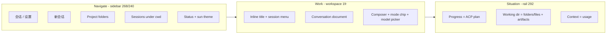
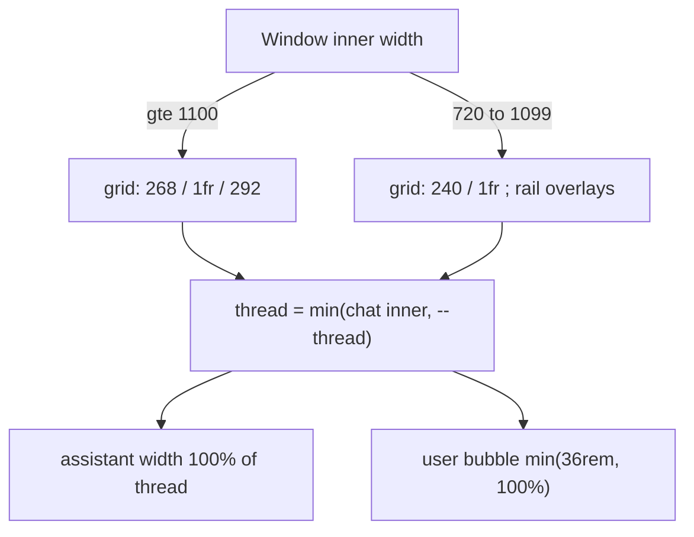

# Grok Build Desktop: a real graphical agent client

| Field | Value |
| --- | --- |
| Title | Product + UX design: Grok Build Desktop as a graphical agent client |
| Author | Grok Build Desktop (draft) |
| Date | 2026-08-14 |
| Status | Draft |
| Current ship | 0.3.5 (`package.json`, `src-tauri/tauri.conf.json`) |
| Installed app | `/Applications/Grok Build.app` (`com.stauch.grokbuild`) |
| Target ship | 0.4.0 (IA + layout, two PRs) |

---

## Overview

Grok Build Desktop is Stauch’s local Tauri shell over the existing `grok agent stdio` ACP process. Version 0.3.5 already does the hard backend work: project-first session restore from `~/.grok/sessions`, streaming text / thought / tool / plan / usage, permission cards, `@` file mentions, and Settings that read/write `~/.grok/config.toml`. The window, however, still behaves like a chat-app skin: assistant replies are capped at 86% of a pixel-fixed thread, the three-column grid does not collapse so a 880 px window grows a horizontal scrollbar, and several controls (footer gear, header chevron, model chip, rail card chevrons, MCP “连接器”, a bar-chart folder preview, a permanent 3-circle stepper) are either decorative or duplicated.

This design treats the desktop as a **graphical agent client**, not a Claude Desktop / Cowork replica. Each column has one job. Every control either does a real job against ACP, `~/.grok`, or the filesystem, or it is absent. Placeholder chrome is allowed only as an empty state, and it unmounts the moment real data arrives. Layout becomes a fluid conversation column (`width: min(100%, var(--thread))`) with a collapsing grid so overflow-x never appears.

---

## Background & Motivation

### What the product is

The desktop is an ACP client. It must not grow a second config system, a private protocol, or a reimplemented harness. Those constraints are already decided:

- Spawn and keep `grok agent stdio` (`start_agent` in `src-tauri/src/lib.rs`).
- One `~/.grok` for sessions, `config.toml`, memory. UI prefs only in `~/.grok/webui.json`.
- Project folders first; sessions nested under cwd (`groupSessions` in `src/lib/projects.ts`).
- Body copy stays on the Anthropic Serif / Source Serif 4 stack (`--serif` in `src/styles.css`).
- Foldable tool/thought rows stay on the custom `Fold` component, not WebKit `details/summary` + flex.

### Why the current chrome is wrong

0.3.5 borrowed visual pieces from Claude-style agent desktops without taking the jobs those pieces do. In Claude Desktop, a model chip switches models, a title chevron opens session actions, a connectors list is how that product attaches MCP to a conversation, and a 3-step row is a Cowork empty-state for a product that does not already stream a structured plan. Grok Build already has those jobs elsewhere:

| Borrowed chrome | Why it exists in the source product | Where the job already lives here |
| --- | --- | --- |
| Footer gear | Settings has no other entry | Sidebar tab `设置` + `SettingsPanel` |
| Title chevron | Session actions menu | `/rename` in `src/lib/commands.ts` (not local); `deleteSession`; `openPath` |
| Composer model chip + chevron | Mid-session model switch | `patchCliSettings({ model })`; TUI `/model`; Settings “默认模型” |
| Context “连接器” | Per-conversation MCP attachments | Settings MCP toggles from `config.toml` (`cli.mcp`) |
| Folder bar-chart | Decorative project preview | `list_project_files` (files only, for `@`); `chat.artifacts`; `openPath(cwd)` |
| Permanent 3-circle stepper | Cowork “steps” illustration | ACP `plan` updates already stored on `ChatState.plan` |

The user rejected cargo-cult cloning. The design rule is: understand the job, then either wire a real control or delete the chrome.

### Concrete defects in 0.3.5

1. **Replies do not fill the conversation column.** `.msg { max-width: 78% }`, `.msg.assistant { max-width: 86% }`, `.msg.user { max-width: 78% }` (`src/styles.css`). The thread is already a dedicated column; the extra inset is chat-bubble leftover.
2. **Thread width is an absolute pixel.** `--thread` is set from `chatWidth` state (default 680, Settings slider 520–920). CSS already says `width: min(100%, var(--thread, 680px))`, but the app grid is `268px minmax(0, 1fr) 292px` with `minWidth: 880`. At 880 px the workspace is 320 px, padding eats 56 px, and unbreakable URLs / `pre` / Settings padding (`12px 56px` + 440 px fields) overflow. Small windows grow a horizontal scrollbar.
3. **Footer gear opens Settings.** Settings is already a tab. The corner the user actually wants is a sun control that toggles day/night. Theme already persists in `webui.json`.
4. **Workspace header chevron has no menu** (`App.tsx` around the `h1` next to `currentTitle`). `/rename` is listed in `SLASH_COMMANDS` but is not `local`, so `runSlash` only stuffs `/rename ` into the composer.
5. **Context card lists MCP “连接器”.** Those are process-level tools from `config.toml`, not this turn’s working set.
6. **Working directory card is a chart icon plus a flat basename/artifact list.** `list_project_files` returns files only (depth 4, cap 80). Its skip set is the `matches!` in `lib.rs` (`node_modules` | `.git` | `target` | `dist` | `.next` | `__pycache__`). Folders are invisible.
7. **Decorative placeholders survive after content exists.** Progress always paints the 3-circle row, then the todo list. Folder preview always paints `IconChart`.
8. **Progress empty-state and filled-state are stacked.** User rule: if `plan.length > 0`, show only the todo list.

---

## Goals & Non-Goals

### Goals

- Give the three columns a coherent information architecture and delete chrome that has no job.
- Make the conversation column fluid: fill the workspace until a max measure, then stop. Assistant text uses the full column. A narrow window never produces overflow-x.
- Replace the footer gear with a real theme toggle. Keep Settings as the tab + panel it already is.
- Session display names are client-owned: start from Grok’s generated title, persist user overrides in `~/.grok/webui.json`. Inline edit in the header. Do not patch `summary.json`.
- Session title menu for new / delete / reveal / copy. Rename is the inline field, not a prompt.
- Real Agent / Plan / 始终批准 mode chip in the composer, next to the model chip, with the write path below.
- Sidebar search/filter over project name + display title.
- Remove MCP from the Context card.
- Show working-directory entries as folders vs files, plus this-turn artifacts only when they exist.
- Treat the 3-circle stepper as an empty state that unmounts when `ChatState.plan` is non-empty.
- Add only the Rust the UI still needs: `list_workspace_entries` and `SessionSummary.dir`. No `rename_session`.
- Ship in two independently reviewable PRs against this repo.

### Non-goals

- Pixel-perfect Claude / Cowork / Codex chrome.
- Official xAI desktop branding or a second config root.
- Reimplementing the harness, MCP runtime, skills, memory, sandbox, or worktrees.
- Inventing `session/set_model` or any ACP method not already used.
- Patching `summary.json` `generated_title` as the rename source of truth.
- Fork, rewind, dashboard, Imagine, voice, menu-bar status, multi-agent.
- ECC-style “80% coverage on everything.”
- Changing the Serif body stack or reverting `Fold` to `details/summary`.

---

## Proposed Design

### Information architecture

The window is three columns with one job each. Nothing in a column is allowed to duplicate another column’s job.



**Navigate (`.sidebar`).** “Which project, which session, is the agent connected, what is the ambient theme?” This is a file-manager + connection strip, not a settings drawer. Settings stays a sibling tab because it edits `config.toml`, which is not navigation.

**Work (`.workspace`).** “The conversation as a document, plus the prompt.” The thread is the product. The header identifies the document and offers actions on it. The composer is how you advance the turn.

**Situation (`.rail`).** “What is the agent doing now, where is it working, how full is this session?” This is turn-local. Global tools (MCP) and global defaults (model catalog, permission mode, memory) stay in Settings.

That split is why connectors leave the rail: MCP enablement is not “context of this conversation.” It is how the `grok` process was configured. Showing enabled servers next to token usage implies they are per-session attachments. They are not. `session/new` already passes `mcpServers: []` and lets the CLI apply `config.toml`.

### Layout system

#### The conversation column

The thread is a **max-width column**, not a fixed-width column.

Definitions used everywhere below (do not mix them):

```
W            = window inner width
S            = sidebar track (268 if W ≥ 1100, else 240)
R            = rail grid track (292 if W ≥ 1100 and railOpen, else 0)
workspace    = W − S − R
chat inner   = workspace − 56    (`.chat` / `.composer-wrap` pad 28 + 28)
settings box = workspace − 112   (`.settings` pad 56 + 56 at every width)
thread       = min(chat inner, chatWidth)
```

`chatWidth` is today’s state, still applied as the CSS custom property **`--thread`** on `.thread` and `.composer-wrap` (same token 0.3.5 already sets). It is a **max**, which is what `width: min(100%, var(--thread, 680px))` already expressed. Settings label becomes “对话列最大宽度”. Default **760** (up from 680). Slider **560–920**, step 20. Existing `webui.json` values in `[480, 1100]` keep loading; the Settings slider clamps to 560–920 on next edit. Do **not** rename the token to `--thread-max` in 0.4.0.

CSS (conceptual; applied in `src/styles.css`):

```css
.thread,
.composer-wrap .composer,
.composer-wrap .disclaimer,
.composer-wrap .permission,
.composer-wrap .mention {
  width: min(100%, var(--thread, 760px));
  max-width: 100%;
}
.msg { max-width: 100%; margin: 0 0 18px; }
.msg.assistant { align-self: stretch; width: 100%; max-width: none; }
.msg.user {
  align-self: flex-end;
  width: fit-content;
  max-width: min(36rem, 100%);
}
.md { overflow-wrap: anywhere; }
.md pre { max-width: 100%; overflow-x: auto; }
.chat, .settings, .session-list, .rail {
  overflow-x: hidden;
  overflow-y: auto;
}
.field, .mcp-list, .lead {
  max-width: min(440px, 100%);
}
```

#### Why the assistant fills and the user does not

The assistant reply **is** the document: markdown, lists, diffs, code fences. Insetting it to 86% of an already-narrow column is why the user said the reply does not 撑满对话框. Full column width is the job.

The user turn stays a right-aligned bubble at `min(36rem, 100%)`:

- User prompts are usually short. A full-width beige bar for “修一下这个” reads as a system banner, not a prompt.
- The contrast (prompt bubble vs full-width serif document) is the agent-client pattern, not a chat-app pattern.
- At a 400 px thread, `min(36rem, 100%)` collapses to 100%, so a long paste still uses the column and does not overflow.

If a later session shows that long user pastes feel cramped, raise the cap to `48rem`. Do not start at 100% for both roles.

#### Grid collapse, so overflow-x cannot appear

Root cause is not the thread `min()` (that already shrinks). Root cause is **fixed chrome** plus **unbreakable descendants**. Using the definitions above (`railOpen === true`):

| W | S | R | workspace | chat inner / thread | settings box (pad 56+56) |
| --- | --- | --- | --- | --- | --- |
| 1480 | 268 | 292 column | 920 | 864 → thread 760 (stops) | 808 |
| 1280 default | 268 | 292 column | 720 | 664 → thread 664 (follows) | 608 |
| 1100 | 268 | 292 column | 540 | 484 → thread 484 | 428 |
| 1000 | 240 | 0 (overlay) | 760 | 704 → thread 704 | 648 |
| 720 min | 240 | 0 (overlay) | 480 | 424 → thread 424 | 368 |

Settings pad stays `12px 56px 48px` at **every** width. Do not shrink that pad at the 1100 rail breakpoint — that is what made the 1100 row lie (old “settings box = workspace − 32” was the *narrow* pad applied to a *wide* row). Fields use `max-width: min(440px, 100%)` at all widths, so the 1100 box (428) and the 720 box (368) both fit. Today’s `.field { max-width: 440px }` plus 56+56 is 552 px, which overflows the 540 px workspace at 1100.

Rules:

1. **Lower `minWidth` from 880 to 720** in `src-tauri/tauri.conf.json`. `minHeight` stays 600. Default size stays 1280×840.
2. **Below 1100 px, the rail does not take a grid track.** `App` tracks `narrow` with `window.matchMedia("(max-width: 1099px)")`. When `narrow && railOpen`, `.app` gets `rail-overlay` and `.workspace` mounts `.rail-backdrop` (see Overlay rail contract — **not** a child of `.app`). When `!railOpen` the rail is unmounted (today’s `{railOpen && <aside className="rail">}`).
3. **Below 1100 px, sidebar width is 240.** Traffic lights already sit in the 46 px `.titlebar` drag region; 240 is enough.
4. **Do not hide the sidebar** inside the supported range. At 720 with overlay rail, **workspace is 480** and **thread is 424**. That is usable. A hamburger would add a fourth piece of chrome for a personal desktop that opens at 1280.
5. **Hard overflow locks:** `.app { overflow-x: hidden; position: relative }` (`position: relative` is required so the overlay rail’s `top: 52px; right: 0` is against the window grid; today `.app` is not positioned and `.workspace` is). `.workspace`, `.sidebar`, `.rail` already have `min-width: 0`. `.chat`, `.session-list`, `.rail`, `.settings` use `overflow-x: hidden; overflow-y: auto` (today they are `overflow: auto`, which is where the horizontal bar actually appears). `.url-row` gets `flex-wrap: wrap`. `.field, .mcp-list, .lead { max-width: min(440px, 100%) }` at **all** widths. Settings horizontal padding stays 56 px; do not couple it to `narrow`.
6. **`railOpen` is session-only and is not a `webui.json` key.** Wide default is open (column). **When `narrow` becomes true — including first paint if the window starts below 1100 — set `railOpen` to false unless the user has already toggled the rail this session** (`railTouched` ref, set by `IconPanel` and “查看步骤”). Leaving narrow without a user toggle restores `true` so the wide column comes back. The media query never writes disk.



#### Overlay rail contract

Tree today: `.app` → `.sidebar` + `.workspace` + `{railOpen && .rail}`. `.workspace` is already `position: relative`. `.app` is not; add `position: relative` so the overlay rail is positioned against the window, not an undefined ancestor.

`.workspace-head` is `flex: 0 0 52px`. The overlay must **not** cover `.head-actions` / `IconPanel`. The backdrop must **not** cover `.sidebar`. `railOpen` defaults `true` and is not persisted, so a 720–1099 launch opens with the drawer visible — Navigate must still work on that first frame.

**Mount `.rail-backdrop` as a child of `.workspace` only.** JSX: inside `<main className="workspace">`, after the header, when `narrow && railOpen`. Do not mount it on `.app`. Clicks on 会话 / 设置 / project rows / 新会话 must reach the sidebar, not close the rail.

`.toast` today has no z-index (`.mention` is 5). `.head-actions` has no `position` today; z-index is a no-op until it is positioned. Stacking:

| Layer | Hook | z-index | Notes |
| --- | --- | --- | --- |
| Sidebar | `.sidebar` | auto | **not dimmed, not covered.** No hit-target over Navigate |
| Workspace chrome | `.workspace-head` | auto | 52 px; `IconPanel` lives here |
| Backdrop | `.workspace > .rail-backdrop` | 3 | `position: absolute; inset: 52px 0 0 0` (under the header, **inside** `.workspace`); click → `setRailOpen(false)`. Dims only the conversation / Settings / composer |
| Overlay rail | `.app.rail-overlay .rail` | 4 | `position: absolute` on `.app`; `top: 52px; right: 0; bottom: 0; width: 292px`. Padding **overridden** to `12px 18px 24px` (the column’s `56px 18px 24px` was to clear the titlebar; after `top: 52px` that 56 px would start the first card at 108 px) |
| Header actions | `.head-actions` | 5 | `position: relative; z-index: 5` so `IconPanel` stays a real toggle |
| Session menu / mention | `.menu`, `.mention` | 5 | same band as the header |
| Toast | `.toast` | 6 | must stay visible when the overlay is open (listing / rename errors) |

```css
.app { position: relative; }
.app.rail-overlay { grid-template-columns: 240px minmax(0, 1fr); }
.app.rail-overlay .rail {
  position: absolute;
  top: 52px;
  right: 0;
  bottom: 0;
  width: 292px;
  z-index: 4;
  padding: 12px 18px 24px; /* not the column’s 56 px titlebar pad */
}
.rail-backdrop {
  position: absolute;
  inset: 52px 0 0 0;
  z-index: 3;
}
.head-actions { position: relative; z-index: 5; }
```

Keep `.rail { padding: 56px 18px 24px }` only for the wide grid column (`W ≥ 1100`).

Open: `IconPanel` and “查看步骤” (`setRailOpen(true)`). Close: `IconPanel` (toggle), **workspace** backdrop click, Escape. Escape precedence: if `SessionMenu` is open, close the menu only; else if `narrow && railOpen`, `setRailOpen(false)`; else let the event reach the composer (do not steal Escape from an empty textarea’s default). One `keydown` listener on `window` is enough.

`IconPanel` is the documented toggle at every width. Because the rail’s `top` is 52 px, it never sits on top of that button. Because the backdrop is a `.workspace` child, opening the overlay never disables Navigate. Because a narrow window **defaults the rail closed**, first paint at 720–1099 does not cover the thread at all until the user asks (IconPanel or “查看步骤”).

### Chrome inventory

Every visible control in 0.3.5, with the 0.4.0 verdict.

| Control | File | Job in a real agent client? | Verdict |
| --- | --- | --- | --- |
| 会话 / 设置 tabs | `App.tsx` | No — settings is not navigation | **Delete. Settings is a footer-gear dialog** |
| 新会话 | `startSession` | Yes | Keep |
| 添加项目 | `addProject` / `pickDirectory` | Yes | Keep |
| Project `<details>` + chevron | sidebar | Yes — the chevron discloses children | Keep |
| Session row + click to resume | `resumeSession` | Yes | Keep |
| Session `IconMore` labelled 更多, calls `removeSession` | sidebar | The **job** (delete) is real; the **affordance** (more) is a lie | Replace with the same `SessionMenu` as the header |
| Hidden search input `display: none` | sidebar | Yes — find a project or session | **Ship a real filter** over `groupSessions` (project name + display title) |
| Footnote “不会在设备之间同步” | sidebar | Honest copy | Keep |
| Avatar + connection status | `.side-foot` | Yes — agent liveness | Keep |
| Footer `IconGear` → `openSettings` | `.side-foot` | Duplicate of the 设置 tab | **Replace with sun / moon theme toggle** |
| Header title | `currentTitle` | Yes | **Inline edit**; display `titles[id] \|\| summary.title` |
| Header chevron, no handler | `h1 > span` | Session actions minus rename | **`SessionMenu`** (new / delete / reveal / copy / restore generated title). Rename is the inline field |
| `IconPanel` rail toggle | header | Yes | Keep; also closes overlay rail |
| URL chips from last assistant | `urlChips` / `openPath` | Yes | Keep; wrap |
| 查看步骤 | opens rail when `plan.length > 0` | Yes | Keep |
| Assistant copy button | clipboard | Yes | Keep |
| `Fold` on thought / tool / plan-in-thread | `Fold` | Yes | Keep |
| Composer `+` → slash palette | `filterCommands` | Yes | Keep |
| Model chip + chevron, no handler | `.model-chip` | The job is real; the control is fake | PR 1: read-only label, no chevron. PR 2: real picker (see below) |
| Send / Stop | `sendPrompt` / `cancelTurn` | Yes | Keep |
| Permission card + keys 1–4 | `answerPermission` | Yes | Keep |
| Disclaimer | composer | Honest | Keep |
| Progress `h3` chevron, no handler | rail | No | Delete chevron |
| Progress 3-circle row, always on | `.steps` | Empty-state illustration only | **Mount iff `plan.length === 0`** |
| Progress todo list | `chat.plan` | Yes | Mount iff `plan.length > 0`; exclusive with `.steps` |
| Working dir `h3` chevron | rail | No | Delete chevron |
| `IconChart` in `.folder-preview` | rail | No | **Delete always** |
| “在访达中打开” | `openPath(cwd)` | Yes | Keep |
| Flat artifact basenames | `chat.artifacts` | Yes, as “本轮文件” | Keep, only when non-empty |
| Context `h3` chevron | rail | No | Delete chevron |
| Usage % + mode label | `chat.usage`, `mode` | Usage is real; mode in the rail is the wrong job | Usage meter only. Mode is a **composer chip** next to the model chip (write path below). Never label yolo or `/auto` as Auto |
| Context “连接器” from `cli.mcp` | rail | No — Settings owns MCP | **Delete** |
| Settings appearance toggle | `Settings.tsx` | Yes | Keep (full settings; sun is the ambient shortcut) |
| Settings 对话宽度 slider | `chatWidth` | Yes, once relabelled as a **max** | Keep |

### Sidebar footer: sun, not gear

```
[ G ]  Grok Build              [ sun / moon ]
       已连接 | 连接中 | version
```

- Light theme shows `IconSun`. Dark theme shows `IconMoon`. Click flips `theme` and `persist({ theme })`, which already writes `~/.grok/webui.json` and sets `document.documentElement.dataset.theme`.
- `aria-label="切换浅色/深色"`.
- Add `IconSun` and `IconMoon` to `src/icons.tsx`. `IconGear` can remain exported; Settings does not need it.
- Do not add a gear anywhere else. The 设置 tab is the settings entry.

### Session titles are client-owned

Display name is **not** a patch of `summary.json`. Grok keeps generating `generated_title` / `session_summary`; the desktop stores the user’s name beside that.

```
displayTitle(s, titles) = titles[s.id]?.trim() || s.title || "未命名会话"
```

`s.title` is still whatever `parse_summary` already returns (`generated_title` then `session_summary` then “未命名会话”). That is the **initial** name. After the user edits, the override lives in `~/.grok/webui.json`:

```ts
titles?: Record<string, string>; // sessionId → override, 1–80 chars
```

Pick `webui.json`, not a file under the project directory: the desktop already owns that file, session ids are UUIDs, and a notes file inside the repo would show up in git. Do **not** add a Rust `rename_session`. Do **not** write `generated_title`.

```ts
// src/lib/projects.ts
export function displayTitle(
  s: { id: string; title: string },
  titles: Record<string, string> = {},
): string {
  const o = titles[s.id]?.trim();
  return o || s.title || "未命名会话";
}

export function setTitleOverride(
  titles: Record<string, string>,
  id: string,
  title: string,
): Record<string, string> {
  const t = title.trim().slice(0, 80);
  if (!t) {
    const next = { ...titles };
    delete next[id];
    return next;
  }
  return { ...titles, [id]: t };
}
```

`currentTitle` in the header and every sidebar row use `displayTitle`. Clearing the override (empty commit, SessionMenu “恢复自动标题”, `/rename --auto`) deletes `titles[id]` so the generated title returns.

#### Inline title edit

The header title is the rename UI. Not `window.prompt`.

- Idle: a `<button type="button" className="session-title-btn">` showing `displayTitle` (so `button { -webkit-app-region: no-drag }` wins over `.workspace-head { -webkit-app-region: drag }`). A separate chevron button opens `SessionMenu`.
- Click the title (or SessionMenu “重命名”, or bare `/rename`): replace the button with an `<input>` (`-webkit-app-region: no-drag`), select-all, focus.
- Enter: commit if 1–80 chars after trim; `persist({ titles })`. Reject empty and reject the literal `--auto`.
- Escape: cancel, restore previous display, no persist.
- Blur: same as Enter if the value changed and is valid; else cancel.
- No session id: the control is inert text “新会话”.

Sidebar rows stay click-to-resume. They show `displayTitle` but are not inline-editable (the header is).

#### SessionMenu (no prompt)

`SessionMenu` interaction (one contract, two anchors):

- One instance (`menuFor: null | { kind: "header" } | { kind: "row"; id: string }`).
- Panel is `position: absolute` anchored to the trigger.
- Dismiss on click-outside, on Escape (menu first, then overlay rail, then cancel an open title input), and on picking an action.
- Focus returns to the trigger after close.
- Sidebar `IconMore` calls `event.stopPropagation()` so the row does not also `resumeSession`.

| Action | Enabled | Implementation |
| --- | --- | --- |
| 重命名 | `sessionId` present | Start the inline editor. Not a prompt. |
| 恢复自动标题 | override exists for this id | `setTitleOverride(titles, id, "")` + persist |
| 在此项目新开会话 | `cwd` present | existing `startSession()` |
| 删除 | `sessionId` present | existing `removeSession` (confirm stays). Also drop `titles[id]` |
| 在访达中显示 | `session.dir` present | existing `openPath(session.dir)` (needs `dir` from PR 2) |
| 复制会话 ID | `sessionId` present | clipboard |
| 复制项目路径 | `cwd` present | clipboard |

Do **not** put Fork, Rewind, Pin, or Dashboard in this menu.

#### `/rename` still needs rest-of-line

`sendPrompt` today discards everything after the first token when `found.local`. Required:

```ts
async function runSlash(cmd: CommandDef, rest = "") { /* … */ }
// sendPrompt: runSlash(found, text.slice(name.length).trimStart())
// palette: runSlash(c)  // rest === ""
```

```ts
// src/lib/commands.ts — /rename becomes local: "rename"
export type RenameArgs =
  | { kind: "edit" }
  | { kind: "auto" }
  | { kind: "title"; title: string }
  | { kind: "error"; message: string };

export function parseRenameArgs(rest: string): RenameArgs {
  const t = rest.trim();
  if (!t) return { kind: "edit" };
  if (t === "--auto") return { kind: "auto" };
  if (t.startsWith("--auto ") || t.startsWith("--auto\t")) {
    return { kind: "error", message: "/rename --auto 不能带标题" };
  }
  return { kind: "title", title: t.slice(0, 80) };
}
```

| Input | Action |
| --- | --- |
| Palette or typed `/rename` | Start the inline editor |
| `/rename --auto` | Clear `titles[id]` |
| `/rename Some title` | `setTitleOverride(..., rest)` |
| `/rename --auto Something` | toast error |

Tests in `src/lib/commands.test.ts` and `src/lib/projects.test.ts` (`displayTitle`, `setTitleOverride` clear/set). No Rust.

`SessionSummary.dir` is still added in PR 2 for Finder reveal. That is the only session-disk write we do **not** do: we never write `summary.json`.

### Sidebar search

Delete `style={{ display: "none" }}`. The existing `.search` input becomes a real filter over the already-built tree.

```ts
// src/lib/projects.ts
export function filterProjectTree(
  tree: ProjectNode[],
  query: string,
  titles: Record<string, string> = {},
): ProjectNode[] {
  const q = query.trim().toLowerCase();
  if (!q) return tree;
  return tree
    .map((p) => ({
      ...p,
      sessions: p.sessions.filter((s) => {
        const name = displayTitle(s, titles).toLowerCase();
        return name.includes(q) || s.title.toLowerCase().includes(q);
      }),
    }))
    .filter((p) => p.name.toLowerCase().includes(q) || p.sessions.length > 0);
}
```

`useMemo(() => filterProjectTree(groupSessions(...), search, titles), [...])`. Empty query returns the full tree. A query that matches a project name keeps all of that project’s sessions. 0.3.5 only loads sessions for the current cwd; the filter does not invent a full-library scan. Placeholder: “搜索项目或会话”. Test in `projects.test.ts`: match by override title, match by project name, empty query identity.

### Composer model chip

The chip exists because a graphical agent client must show **which model this session is on**, and let you change the **default for new sessions** without opening Settings. A chevron with no menu is a lie.

0.3.5 does **not** already hydrate the story the first draft claimed. Facts:

- `parse_summary` fills `SessionSummary.model` from `current_model_id`.
- `resumeSession` never copies `s.model` into React state. The chip renders `{model}` (`App.tsx` ~722–724).
- Boot (`~211–220`) does `setModel(cliState.model)` then **overwrites** with `webui.json` `state.model`. Settings `patch({ model })` updates `config.toml` and `setModel` via `onCli`, but does **not** `persist({ model })`. After a Settings edit, next launch restores the stale webui value.
- There is no `sessionModel` variable today.

Correct state split for 0.4.0:

| Symbol | Meaning | Writers | Readers |
| --- | --- | --- | --- |
| `model` | **Default** for new sessions (`[models].default`) | chip pick, Settings `patch({ model })` | chip menu checkmark, `createAcpSession` does not send a model today (CLI default applies) |
| `sessionModel` | `sessions.find(s => s.id === sessionId)?.model ?? null` | none (derived). `resumeSession` / `listSessions` already put `s.model` on the row | chip **label**, differ-toast |

Rules:

- **Do not `setModel` on resume.** That would copy the session’s model into the default and make the differ-toast impossible; a later pick would then write the *session* model into `[models].default`.
- **Boot prefers `cli.model` over `webui.model`.** `if (cliState.model) setModel(cliState.model); else if (state.model) setModel(state.model);` Delete the current “webui always wins” line. `config.toml` is the source of truth; `webui.model` is a cache for when `readCliSettings` fails.
- **Settings and the chip share one write:** `patchCliSettings({ model })`, `setModel`, **and** `persist({ model })`. Settings’ `onCli` must persist when `next.model` changes. That is the bug that makes webui stale today.
- Chip **label:** `sessionModel || model`.
- Chip **menu** options: current `model` plus `{ "grok-4.6", "grok-4.5", "grok-build" }`, de-duplicated. Checkmark on `model` (the default), not on `sessionModel`. Do **not** call `inspect_brief` / `grok inspect` on click.
- Footer row: “在设置中管理…” → `openSettings()`.
- On pick: the shared write above. Do **not** auto-send `/model <id>` as a `session/prompt`. Mid-session switch stays a typed slash command (`04-slash-commands.md`).
- Differ toast, only when `sessionModel` is a non-empty string and `sessionModel !== nextDefault`: “已写入默认模型，当前会话仍是 {sessionModel}。用 /model 可切换本会话。”

Chevron stays, because the action is real. This picker ships in **PR 2**, after the hydration contract is in the same diff as the menu. PR 1 leaves the chip as a read-only label **without** a chevron (honest: it displays `model`, no fake menu).

### Right rail

#### Progress

Extract a pure helper so the empty-state rule is testable and not buried in JSX:

```ts
// src/lib/rail.ts
export function progressPresentation(plan: PlanEntry[]):
  | { kind: "empty" }
  | { kind: "list"; entries: PlanEntry[] } {
  return plan.length === 0 ? { kind: "empty" } : { kind: "list", entries: plan };
}
```

Render:

- `empty`: card title “进度” (no chevron). The existing 3-circle `.steps` row. The existing sentence “较长任务的待办会显示在这里…”.
- `list`: card title “进度”. **Only** the `.todo` list bound to `plan`. No `.steps`. No extra empty copy.

The in-thread `Fold label="计划"` that `ChatRow` already renders for `kind === "plan"` items is a separate, honest fold: it is a chat item. `applyChatUpdate` currently stores plan on `state.plan` and does **not** push a `kind: "plan"` item (`chat.test.ts` asserts this). Leave that as-is. The rail is the plan’s home. “查看步骤” remains the jump from thread to rail.

#### Working directory

Two modules, visually distinct, both absent when they have nothing to show.

```
工作目录
  {basename(cwd)}          [在访达中打开]
  文件夹
    IconFolder  src/
    IconFolder  src-tauri/
  文件
    IconFile    package.json
    IconFile    README.md
  本轮文件                  only if chat.artifacts.length > 0
    IconFile    src/App.tsx
```

Rules:

- No `.folder-preview`, no `IconChart`, ever. That node is deleted from CSS and JSX.
- No cwd: one muted line “尚未选择项目”. Stop.
- Cwd set: basename + Finder button, then the listing.
- Listing is **top-level only** (depth 1). This is a place map, not `@` search. `@` keeps using `list_project_files` (recursive files, depth 4, cap 80).
- Directories first, then files, `localeCompare(..., "zh")`. Cap 40. Skip names `node_modules`, `.git`, `target`, `dist`, `.next`, `__pycache__` (same set as `list_project_files`). Dotfiles omitted unless we later add “显示隐藏”; do not ship a hidden toggle in 0.4.0.
- Click any row → `openPath(absolutePath)`.
- “本轮文件” is `chat.artifacts` (already filled by `mergeArtifacts` from tool diffs / locations), last 8, never mixed into the live listing.
- Load entries when `cwd` changes and when the rail opens. No polling. A failure toasts and shows basename + Finder only.

New Rust command; do **not** overload `list_project_files`:

```ts
export type WorkspaceEntry = {
  name: string;
  path: string;          // absolute
  kind: "dir" | "file";
};

export const listWorkspaceEntries = (cwd: string) =>
  invoke<WorkspaceEntry[]>("list_workspace_entries", { cwd });
```

```rust
// same guards as list_project_files: reject "", "/", $HOME
// WalkDir::new(&root).max_depth(1)
// OMIT the start path: if entry.depth() == 0 { continue; }  // cwd itself is not a row
// skip names with the existing matches! list in list_project_files
//   (node_modules | .git | target | dist | .next | __pycache__)
// cap 40 children, not counting the omitted root
// return { name, path, kind }
// (frontend partitionWorkspace will sort anyway)
```

Frontend helper in `src/lib/rail.ts`:

```ts
export function partitionWorkspace(entries: WorkspaceEntry[]) {
  const byName = (a: WorkspaceEntry, b: WorkspaceEntry) =>
    a.name.localeCompare(b.name, "zh");
  return {
    dirs: entries.filter((e) => e.kind === "dir").sort(byName),
    files: entries.filter((e) => e.kind === "file").sort(byName),
  };
}
```

Icons: `IconFolder` and `IconFile` in `src/icons.tsx`. Small, stroke, same 16 px language as the rest of the set.

#### Context

After connectors are gone, the card is this session’s **budget**. Usage meter only (`!usage?.size` → “连接后显示用量”). No MCP, no `IconPlug`, no mode switch, no duplicate model line.

#### Composer mode chip

Plan / Agent / 始终批准 is an input option for the next turn, same family as the model chip, immediately left of it, left of send:

```
[+]                    [Agent ▾]  [grok-4.6 ▾]  [↑]
```

A dropdown chip, not a three-segment control and not a rail widget. Claude Desktop, Cursor, and Copilot all put mode in the prompt box next to the model / send controls. Grok TUI cycles the same three modes with Shift+Tab.

Labels (never call `yolo` or `/auto` “Auto”):

| Chip | Internal `mode` | Same job as |
| --- | --- | --- |
| Agent | `"agent"` | `/auto` |
| Plan | `"plan"` | `/plan` |
| 始终批准 | `"yolo"` | `/always-approve` |

There is still no `/yolo` slash. The current rail line that maps `yolo → "Auto"` is deleted. When `mode === "yolo"` the chip uses the permission warning tint so the dangerous mode is visible without opening the menu.

Write path — `applyMode(next: Mode)`:

1. `setMode(next)` and `persist({ mode: next })`.
2. **Live session** means `sessionIdRef.current` is set, `readyRef.current` is true, and not `loadingSession`. If live **and** not `busy`, send the matching slash as a real ACP turn via `sendSlashToAgent(text)`:
   - Agent → `"/auto"`
   - Plan → `"/plan"`
   - 始终批准 → `"/always-approve"`
3. If live **and** `busy`: apply step 1 only; toast “将在下一轮生效”.
4. If **no** live session: step 1 only. This is a next-turn hint. The next `session/new` already sends `_meta.yoloMode: true` when `mode === "yolo"`. Plan with no session is local until the user sends their first prompt after `session/new`; the first user prompt does **not** auto-prefix `/plan`. Document that: open a session, then tap Plan (or type `/plan`) before the work prompt. If they tap Plan on an empty “新会话” with no `sessionId`, the hint is stored and the first composer send is **not** rewritten.

`sendSlashToAgent` is **not** `sendPrompt`. `sendPrompt("/plan")` today hits `found.local` and never reaches the agent. The helper:

```ts
async function sendSlashToAgent(text: string) {
  await ensureAgent();
  let sid = sessionIdRef.current;
  if (!sid) sid = await createAcpSession();
  await rpc("session/prompt", {
    sessionId: sid,
    prompt: [{ type: "text", text }],
  });
}
```

Do not append a user bubble for these slashes. Do not set `echoedUser`. The composer chip, slash palette, and Shift+Tab (Agent → Plan → 始终批准 → Agent) all call `applyMode`. Shift+Tab does not fire while the slash or `@` menu is open.

Settings remains the place that patches the CLI `ui.yolo` **default**. The composer does not write `config.toml`.

### Persistence

`~/.grok/webui.json` (`load_webui_state` / `save_webui_state`) stays the only desktop-owned file. Allowed keys after this change:

```ts
type WebuiState = {
  projects?: string[];
  theme?: "light" | "dark";
  model?: string;          // cache of the default; boot prefers cli.model
  showThinking?: boolean;
  mode?: "agent" | "plan" | "yolo";
  chatWidth?: number;      // thread MAX, 560–920 effective
  titles?: Record<string, string>; // sessionId → user override
};
```

Do **not** add `railOpen`, MCP, tokens, or file listings. Theme already works. `model` is a cache; `config.toml` `[models].default` wins on boot. `titles` is the only session-name store. Do not write `summary.json`.

### Extracted UI helpers (keep App.tsx from growing more)

0.3.5 already parks logic in `src/lib/{chat,commands,projects,text}.ts`. New helpers: `src/lib/rail.ts` (`progressPresentation`, `partitionWorkspace`), `src/lib/mode.ts` (`modeLabel`, `slashForMode`, `nextMode`), `displayTitle` / `setTitleOverride` / `filterProjectTree` in `src/lib/projects.ts`, `parseRenameArgs` in `src/lib/commands.ts`. `SessionMenu` lives in `src/SessionMenu.tsx`. Do not invent a component library.

---

## API / Interface Changes

### TypeScript (`src/api.ts`)

```ts
export type SessionSummary = {
  id: string;
  cwd: string;
  title: string;
  model?: string | null;
  agentName?: string | null;
  updatedAt: string;
  createdAt: string;
  numMessages: number;
  dir?: string | null;            // NEW: parent of summary.json
};

export type WorkspaceEntry = {
  name: string;
  path: string;
  kind: "dir" | "file";
};

export const listWorkspaceEntries = (cwd: string) =>
  invoke<WorkspaceEntry[]>("list_workspace_entries", { cwd });
```

No `renameSession` invoke. `listProjectFiles` is unchanged and remains the `@` backend.

### Rust (`src-tauri/src/lib.rs`)

Register **one** new command: `list_workspace_entries`.

Extend `SessionSummary` with `dir: Option<String>` (`#[serde(rename_all = "camelCase")]` already in place) so Finder reveal has a path. Do **not** add `rename_session`. Do not write `summary.json`.

No new ACP methods. `send_raw` / `session/prompt` / `session/new` / `session/resume` stay as they are. Mode slashes ride `session/prompt` through `sendSlashToAgent`.

### Commands (`src/lib/commands.ts`)

```ts
{ name: "/rename", hint: "重命名会话", local: "rename" },
```

`CommandDef.local` union gains `"rename"`. Add `parseRenameArgs`. Change `runSlash(cmd, rest = "")` and have `sendPrompt` pass the text after the first token. Palette clicks pass `""`. `/plan`, `/always-approve`, `/auto` call `applyMode`.

### CSS / window

- `src/styles.css`: message widths, keep token `--thread`, wrap, `.app { position: relative }`, `.app.rail-overlay` / `.app.rail-overlay .rail { padding: 12px 18px 24px }`, `.rail-backdrop` (child of `.workspace` only), `.field, .mcp-list, .lead { max-width: min(440px, 100%) }` at all widths, `overflow-x: hidden; overflow-y: auto` on `.chat` / `.settings` / `.session-list` / `.rail`, `.toast { z-index: 6 }`, `.head-actions { position: relative; z-index: 5 }`, delete `.folder-preview` as a chart well (reuse spacing on a `.dir-mod` list if needed).
- `src-tauri/tauri.conf.json`: `"minWidth": 720`.

---

## Data Model Changes

No database. One desktop-owned file grows keys. `summary.json` is **not** written.

### `webui.json`

Additive keys: `titles?: Record<string, string>`, and `chatWidth` meaning becomes “max” (compatible with `min(100%, var(--thread))`). Users who saved 680 keep 680 as their max. Missing `titles` is `{}`.

### `summary.json`

Read-only for the desktop. `parse_summary` still supplies the generated fallback title. No patch.

### In-memory

`ChatState` is unchanged. `titles` is React state hydrated from webui. `sessionModel` is `sessions.find(s => s.id === sessionId)?.model ?? null`. `railTouched` is a ref, not persisted.

---

## Alternatives Considered

### 1. Keep 86% bubbles; only raise the percentage

Raising `.msg.assistant` from 86% to 100% and leaving the grid alone fixes defect 1 and ignores 2. The 880 px window still overflows from rail + Settings padding + unbreakable `pre`. Rejected as incomplete. The fill rule is kept **and** the grid collapses.

### 2. Delete `chatWidth` and hard-code `min(100%, 760px)` in CSS

A single CSS max is simpler and would match “follow the window until a max.” The slider already exists and is the right affordance for a readable serif measure (some people want 560, some want 900). Relabel it. Rejected deletion.

### 3. Always overlay the rail, even at 1280

Saves 292 px for the thread at the default size, but Situation is a first-class column on a desktop that opens at 1280×840. Overlay is the **narrow** behavior, not the default. Rejected as the always-on model.

### 4. Hide / hamburger the sidebar below 1100

At 720 + 240 sidebar + overlay rail the workspace is already 480 px. A hamburger adds chrome and hides the only navigation the app has. Rejected inside the supported range.

### 5. Send `/rename` and `/model` as `session/prompt` instead of local writes

Rejected for **rename** (client `titles` map is the source of truth; a prompt cannot name a session you are only browsing). Rejected for **model** as the primary path (chip writes `[models].default`). `/model` remains a typed slash for mid-session switch. Plan / 始终批准 / Agent **do** send their slashes when a session is live — that is the mode control, not this alternative.

### 6. Reuse `list_project_files` for the working-directory card

Wrong shape: files only, depth 4, cap 80, relative paths, built for `@` completion. Folders would stay invisible. A depth-1 entries API is the smaller, correct surface. Keep both.

### 7. Delete the right rail

Progress, cwd, and usage are real agent-client jobs (Kimi WebUI, gemini-cli-desktop, and this app’s own ACP reducer already produce `plan` / `artifacts` / `usage`). The rail is not the problem; fake contents are. Rejected.

### 8. Pixel-follow Claude Cowork (connectors + 3-step + chart tile)

Explicitly rejected by the product owner. Those controls exist in Claude because that product’s connectors are per-conversation and its Cowork mode does not stream ACP `plan` entries the way Grok already does.

### 9. Ship the mode control as a read-only label

Rejected by the product owner. 0.4.0 ships a real composer chip (not a rail segment, not a read-only label). The write path is `applyMode` + `sendSlashToAgent` when live (Agent → `/auto`, Plan → `/plan`, 始终批准 → `/always-approve`). Labels never say Auto. A control that only wrote `webui.json` would still be fake; that is why the live prompt is required.

---

## Security & Privacy Considerations

Threat model is a local single-user macOS app talking to a local `grok` binary. No network surface is added.

| Risk | Severity | Mitigation |
| --- | --- | --- |
| `titles` in `webui.json` growing without bound | Low | Keys are session UUIDs; delete the entry on session delete and on “恢复自动标题”. Names only, no paths, no tokens. |
| `list_workspace_entries` walking `$HOME` or `/` | Medium | Same reject list as `list_project_files`: empty, `/`, `$HOME`. Depth 1, cap 40, skip heavy dirs by name. |
| `openPath` on a session dir exposing `updates.jsonl` in Finder | Low | Finder reveal is the point; the files already live in `~/.grok/sessions`. Do not preview `updates.jsonl` in the UI. |
| `dir` on `SessionSummary` pointing outside `~/.grok/sessions` | Low | `dir` is always `summary.json`’s parent from our walk. |
| Theme / rename / listings written into git or memory | Low | `webui.json` stays under `~/.grok`. No secrets in this document or in toasts. |
| Inline title input in a drag region | Low | Control is a `button` / `input` so `no-drag` applies. Escape cancels. |
| Mid-session `/model` as a silent prompt | Medium (surprise turn, token use) | Picker does not send it. |

`is_blocked_path` already denies `~/.ssh`, `~/.gnupg`, and `~/.grok/auth.json` for ACP fs calls. The new commands do not read those paths.

---

## Observability

This is a personal desktop, not a service. Keep the existing channels:

- `showToast` for user-visible failures (rename, listing, open, patch).
- `onAcpStderr` already toasts lines matching `/error|fail/i`.
- No new telemetry. Do not start logging `summary.json` or workspace paths beyond the toast.

When adding `list_workspace_entries`, a failure is a toast and basename + Finder only. Title override failures are persist errors (toast, keep previous `titles`). There is no metric, no alert.

Manual acceptance (see Rollout) is the test for overflow-x and empty-state unmount.

---

## Rollout Plan

No feature flags. The app is installed for one user.

1. **PR 1** lands layout + chrome honesty + client titles + search + mode control. No `config.toml` writes. No `summary.json` writes. Rollback: revert the PR or keep 0.3.5.
2. **PR 2** lands Rust workspace entries + `SessionSummary.dir` + folder/file modules + the model picker (CLI-first hydration). Rollback: revert PR 2; PR 1 remains an improvement.
3. Bump `package.json` and `src-tauri/tauri.conf.json` to **0.4.0** on the second PR. `Cargo.toml` stays `0.1.0` unless the engineer wants a one-line chore.
4. Local verify: `npm test`, `npm run tauri build`, replace `/Applications/Grok Build.app`.
5. Acceptance windows: 1480 / 1280 / 1100 / 1000 / 720. Confirm: no overflow-x (Settings at 1100 and 720); a 720 first paint has the rail **closed**; sidebar still clicks when the overlay is opened; overlay first card at ~64 px; assistant fills; 3-circles vanish when a plan exists; sun toggles; mode segments send `/plan` / `/always-approve` / `/auto` on a live idle session and stay local when there is no session; inline title persist survives reload and does not change `summary.json`; search filters project name and override title.

---

## Open Questions

None. The six product questions (title store, mode control, model catalog, rename UI, sidebar search, narrow rail default) were decided by the user on 2026-08-14 and are recorded in Key Decisions.

---

## References

- This repo: `src/App.tsx`, `src/styles.css`, `src/Settings.tsx`, `src/api.ts`, `src/icons.tsx`, `src/lib/chat.ts`, `src/lib/commands.ts`, `src/lib/projects.ts`, `src/lib/text.ts`, `src-tauri/src/lib.rs`, `src-tauri/tauri.conf.json`
- Tests: `src/lib/chat.test.ts`, `commands.test.ts`, `projects.test.ts`, `text.test.ts` (22 tests at last run)
- Prior research: `_knowledge_base/research-agent-clients-webui-20260814.md`
- Workspace memory: `~/.grok/memory/grok-build-desktop-52b14108/MEMORY.md`
- Grok user guide: `~/.grok/docs/user-guide/04-slash-commands.md` (`/rename`, `/model`), `17-sessions.md` (`generated_title`, `summary.json`), `15-agent-mode.md` (ACP + `x.ai/*`), `07-mcp-servers.md`, `19-plan-mode.md`, `05-configuration.md`
- Installed app: `/Applications/Grok Build.app` (`com.stauch.grokbuild`) 0.3.5
- Not this product: Claude Desktop, Cowork, Codex App, rimusz SwiftUI GrokBuild, phuryn Electron

---

## Key Decisions

1. **Three columns are Navigate / Work / Situation, not a Claude clone.** Sidebar finds things. Center is the document. Rail is this turn’s plan, place, and budget. MCP, model catalog, and permission defaults stay in Settings because they configure the process, not the turn.
2. **Thread is `min(available, max)`. Assistant is 100% of the thread. User stays a bubble at `min(36rem, 100%)`.** That is how a graphical agent client presents “prompt in, document out.” The 78/86% caps were chat-bubble leftover.
3. **`--thread` / `chatWidth` is a maximum, not a width. Keep the token name `--thread`.** Default 760. Slider 560–920, relabelled “对话列最大宽度.” CSS already had `min(100%, var(--thread))`; the bug was chrome that would not yield.
4. **Narrow windows overlay the rail (below header, `IconPanel` stays clickable) and drop `minWidth` to 720. Narrow first paint defaults `railOpen` false unless the user already toggled this session. Wide default is the column. `railOpen` is not persisted.** Sidebar is never under the backdrop. Settings fields are `max-width: min(440px, 100%)` at every width. Overlay rail padding is 12 px. No hamburger.
5. **Placeholder chrome unmounts when data arrives.** 3-circle stepper is empty-state only. `IconChart` is deleted. Card chevrons without a fold are deleted. The hidden search input is **replaced** by a real filter.
6. **Footer: sun toggles theme, gear opens a settings dialog.** The sidebar is only projects and sessions. Settings is a modal over the shell, not a 会话/设置 tab. Theme already persists in `webui.json`.
7. **Header title is an inline editor. `SessionMenu` is new / delete / reveal / copy / restore generated title.** Click title to edit; Enter commits; Escape cancels. Chevron opens the menu. Sidebar `IconMore` opens the same menu.
8. **Session names are client-owned in `webui.json` `titles[sessionId]`.** Initial display is `summary.title` (Grok’s generated title). Override wins. Clearing the key restores the generated title. No `rename_session`. No `summary.json` writes. `/rename` is local via `runSlash(cmd, rest)` + `parseRenameArgs` and writes the same map.
9. **`model` is the CLI default; `sessionModel` is derived from `SessionSummary.model` and is never written back on resume.** Boot prefers `cli.model` over `webui.model`. Chip and Settings both `patchCliSettings` **and** `persist`. Chip catalog is `{grok-4.6, grok-4.5, grok-build}` plus current `model`. Chip does not silently send `/model`.
10. **Mode is a composer chip next to the model chip.** Agent / Plan / 始终批准. Dropdown, not a rail segmented control. `applyMode` + `sendSlashToAgent` when live (`/auto`, `/plan`, `/always-approve`). No live session: local hint only; next `session/new` sends `_meta.yoloMode` iff yolo. Shift+Tab cycles the three modes. Never call yolo or `/auto` “Auto.”
11. **Working directory gets `list_workspace_entries` (depth 1, children only, dirs + files). `@` keeps `list_project_files`.** Two jobs, two APIs. Artifacts stay a separate “本轮文件” module. Omit the WalkDir root.
12. **Connectors leave the Context card.** They already live in Settings, sourced from `config.toml`, sorted by name, without `grok inspect` on open.
13. **No second config root, no secrets in UI or docs, no official-xAI claim.** Desktop state remains `~/.grok/webui.json` (now including `titles`). `railOpen` is not a key.

---

## PR Plan

### PR 1 — Fluid thread, honest chrome, titles, search, mode

- **Title:** `ui: fluid thread, client titles, search, and mode control`
- **Files / components:** `src/styles.css` (thread, overlay rail, backdrop, field max-width, search visible), `src/App.tsx` (`narrow` + `railTouched`, backdrop inside `.workspace`, sun, inline title, `titles` persist, search query, `applyMode` / `sendSlashToAgent`, delete fake chrome), `src/Settings.tsx` (slider label + range only), `src/SessionMenu.tsx` (new), `src/icons.tsx` (`IconSun`, `IconMoon`; drop `IconGear` / `IconChart` / `IconPlug` from the shell), `src/lib/projects.ts` (`displayTitle`, `setTitleOverride`, `filterProjectTree`), `src/lib/projects.test.ts`, `src/lib/commands.ts` (`local: "rename"`, `parseRenameArgs`), `src/lib/commands.test.ts`, `src/lib/rail.ts` (`progressPresentation`), `src/lib/rail.test.ts`, `src-tauri/tauri.conf.json` (`minWidth: 720`)
- **Dependencies:** none
- **Changes:**
  - Layout as already specified (fluid thread, overlay, 720 min, rail **closed** on narrow first paint).
  - Footer sun. Delete connectors, chart, card chevrons, progress `.steps` when a plan exists.
  - Real search input + `filterProjectTree`.
  - Client `titles` map in `webui.json`. Inline header edit. `SessionMenu` without Finder reveal (needs `dir` in PR 2).
  - `/rename` local via `runSlash(cmd, rest)` writes `titles`, not disk sessions.
  - Composer mode chip (next to model) with `applyMode` + `sendSlashToAgent`. Context card is usage only.
  - Model chip is a **read-only** `{model}` label (no chevron). Picker waits for PR 2 so it is not fake.
  - Working-dir card: basename + Finder + artifacts, no chart.
  - Tests: `displayTitle` / `setTitleOverride` / `filterProjectTree`; `parseRenameArgs`; `progressPresentation`.

PR 1 is independently shippable. It does not write `config.toml` or `summary.json`.

### PR 2 — Workspace entries and model picker

- **Title:** `feat: workspace entries, session dir, and model picker`
- **Files / components:** `src-tauri/src/lib.rs` (`list_workspace_entries` omitting WalkDir root, `SessionSummary.dir`, `invoke_handler!`), `src/api.ts`, `src/App.tsx` (boot prefers `cli.model`; model menu; `sessionModel`; load workspace entries), `src/Settings.tsx` (`persist({ model })` on patch), `src/SessionMenu.tsx` (enable 在访达中显示), `src/lib/rail.ts` / `rail.test.ts` (`partitionWorkspace`), `src/icons.tsx` (`IconFolder`, `IconFile`), `package.json` + `src-tauri/tauri.conf.json` version `0.4.0`
- **Dependencies:** PR 1
- **Changes:**
  - Rust `list_workspace_entries` depth-1 children only, same `matches!` skip set as `list_project_files`.
  - `parse_summary` fills `dir`. Finder reveal in `SessionMenu`.
  - Folder / file / 本轮文件 modules.
  - Model picker with CLI-first hydration; catalog `{grok-4.6, grok-4.5, grok-build}` plus current `model`; Settings and chip both persist. Differ-toast uses `sessionModel`.
  - No `rename_session`.

PR 2 is independently reviewable on top of PR 1. It does not reopen layout.
